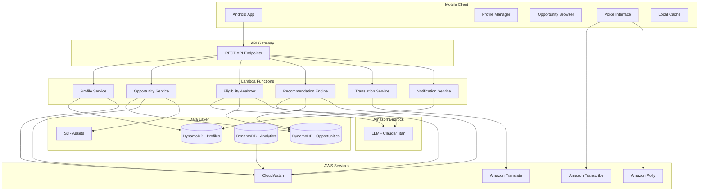

# Design Document: Student Opportunity Navigator

## Overview

The Student Opportunity Navigator is a cloud-native, mobile-first AI system that connects students in Tier 2 and Tier 3 regions of India with educational and career opportunities. The system leverages AWS services including Amazon Bedrock for LLM-powered eligibility analysis, DynamoDB for scalable data storage, Lambda for serverless compute, and API Gateway for RESTful APIs.

The architecture follows a three-tier model:
1. **Mobile Client Layer**: Android application providing the user interface
2. **API Layer**: RESTful APIs exposed through API Gateway
3. **Service Layer**: Lambda functions orchestrating business logic, LLM interactions, and data access

Key design principles:
- **Mobile-first**: Optimized for low bandwidth and offline capabilities
- **AI-powered**: LLM-based eligibility analysis and content generation
- **Multilingual**: Dynamic translation to 9 Indian regional languages
- **Privacy-focused**: Encryption at rest and in transit
- **Scalable**: Serverless architecture with auto-scaling
- **Modular**: Clear separation of concerns for maintainability

## Architecture

### System Components



### Data Flow

**Profile Creation Flow**:
1. Student enters profile data in Android app
2. App sends encrypted profile to API Gateway
3. Profile Service Lambda validates and stores in DynamoDB
4. Response confirms profile creation

**Recommendation Flow**:
1. Student requests recommendations
2. Recommendation Engine retrieves student profile
3. Engine queries active opportunities from DynamoDB
4. For each opportunity, Eligibility Analyzer calls Bedrock LLM with structured prompt
5. LLM returns eligibility determination and explanation
6. Engine ranks eligible opportunities by relevance
7. Translation Service translates content if needed
8. Recommendations returned to mobile client

**Voice Interaction Flow**:
1. Student speaks query in local language
2. Amazon Transcribe converts speech to text
3. Text processed through normal API flow
4. Response text sent to Amazon Polly
5. Audio response played to student

## Components and Interfaces

### Mobile Client (Android)

**Profile Manager**:
- Collects and validates student profile data
- Handles profile updates and synchronization
- Manages local profile cache

**Opportunity Browser**:
- Displays opportunity listings and details
- Implements search and filtering UI
- Shows eligibility status and explanations
- Renders application guidance

**Voice Interface** (Optional):
- Captures voice input
- Integrates with Transcribe and Polly
- Provides audio feedback

**Local Cache**:
- Stores recently viewed opportunities
- Enables offline browsing
- Implements cache invalidation strategy

**API Client**:
- Handles HTTP requests to API Gateway
- Implements retry logic and timeout handling
- Manages authentication tokens
- Compresses request/response payloads

### API Gateway

**Endpoints**:
- `POST /profiles` - Create student profile
- `PUT /profiles/{id}` - Update student profile
- `GET /profiles/{id}` - Retrieve student profile
- `DELETE /profiles/{id}` - Delete student profile
- `GET /opportunities` - List opportunities with filters
- `GET /opportunities/{id}` - Get opportunity details
- `POST /opportunities/{id}/eligibility` - Check eligibility
- `GET /recommendations` - Get personalized recommendations
- `POST /translate` - Translate content
- `POST /notifications/subscribe` - Subscribe to notifications

**Authentication**:
- JWT-based authentication
- Token validation on each request
- Student-scoped access control

### Lambda Functions

**Profile Service**:
```python
def create_profile(event):
    """
    Creates a new student profile
    
    Input: {
        "education_level": str,
        "income_range": str,
        "category": str,
        "skills": List[str],
        "location": str,
        "interests": List[str],
        "preferred_language": str
    }
    
    Output: {
        "profile_id": str,
        "created_at": timestamp
    }
    """
    # Validate required fields
    # Encrypt sensitive data
    # Store in DynamoDB
    # Return profile ID

def update_profile(profile_id, updates):
    """Updates existing profile and triggers re-evaluation"""
    # Validate updates
    # Merge with existing profile
    # Store updated profile
    # Trigger recommendation refresh

def get_profile(profile_id):
    """Retrieves and decrypts profile data"""
    # Fetch from DynamoDB
    # Decrypt sensitive fields
    # Return profile
```

**Opportunity Service**:
```python
def list_opportunities(filters):
    """
    Lists opportunities with optional filters
    
    Input: {
        "type": Optional[str],
        "location": Optional[str],
        "deadline_after": Optional[date],
        "deadline_before": Optional[date],
        "keywords": Optional[str]
    }
    
    Output: {
        "opportunities": List[Opportunity],
        "total_count": int,
        "next_token": Optional[str]
    }
    """
    # Build DynamoDB query with filters
    # Apply pagination
    # Return results

def get_opportunity(opportunity_id):
    """Retrieves full opportunity details"""
    # Fetch from DynamoDB
    # Return opportunity

def create_opportunity(opportunity_data):
    """Creates new opportunity (admin function)"""
    # Validate required fields
    # Check for duplicates
    # Store in DynamoDB
    # Return opportunity ID
```

**Eligibility Analyzer**:
```python
def analyze_eligibility(profile, opportunity):
    """
    Uses LLM to determine eligibility
    
    Input: {
        "profile": StudentProfile,
        "opportunity": Opportunity
    }
    
    Output: {
        "eligible": bool,
        "explanation": str,
        "confidence": float
    }
    """
    # Construct structured prompt
    # Call Bedrock LLM
    # Parse response
    # Return eligibility determination

def construct_eligibility_prompt(profile, opportunity):
    """
    Builds structured prompt for LLM
    
    Template:
    You are an eligibility analyzer for educational opportunities.
    
    Student Profile:
    - Education Level: {profile.education_level}
    - Income Range: {profile.income_range}
    - Category: {profile.category}
    - Location: {profile.location}
    - Skills: {profile.skills}
    
    Opportunity Eligibility Criteria:
    {opportunity.eligibility_criteria}
    
    Determine if the student is eligible. Respond in JSON:
    {
        "eligible": true/false,
        "explanation": "detailed explanation",
        "matching_criteria": ["list of met criteria"],
        "missing_criteria": ["list of unmet criteria"]
    }
    """
    # Format prompt with profile and criteria
    # Return prompt string
```

**Recommendation Engine**:
```python
def generate_recommendations(profile_id, limit=50):
    """
    Generates personalized recommendations
    
    Input: {
        "profile_id": str,
        "limit": int
    }
    
    Output: {
        "recommendations": List[{
            "opportunity": Opportunity,
            "relevance_score": float,
            "eligibility": EligibilityResult
        }]
    }
    """
    # Retrieve student profile
    # Query active opportunities
    # For each opportunity:
    #   - Check eligibility via Eligibility Analyzer
    #   - Calculate relevance score
    # Sort by relevance score
    # Return top N recommendations

def calculate_relevance_score(profile, opportunity):
    """
    Calculates relevance score based on profile match
    
    Scoring factors:
    - Location match: 30%
    - Interest alignment: 25%
    - Skill match: 20%
    - Education level fit: 15%
    - Deadline proximity: 10%
    """
    # Calculate component scores
    # Weight and sum
    # Return normalized score (0-1)
```

**Translation Service**:
```python
def translate_content(text, target_language):
    """
    Translates content to target language
    
    Input: {
        "text": str,
        "target_language": str,  # ISO 639-1 code
        "source_language": "en"
    }
    
    Output: {
        "translated_text": str,
        "source_language": str,
        "target_language": str
    }
    """
    # Call Amazon Translate
    # Handle translation errors
    # Return translated text

def batch_translate(texts, target_language):
    """Translates multiple texts efficiently"""
    # Batch texts for API efficiency
    # Call Amazon Translate
    # Return translated texts in order
```

**Notification Service**:
```python
def send_deadline_reminder(profile_id, opportunity_id):
    """Sends deadline reminder notification"""
    # Retrieve profile and opportunity
    # Format notification message
    # Translate to preferred language
    # Send via SNS to mobile device

def send_new_opportunity_notification(profile_id, opportunity_id):
    """Notifies student of new matching opportunity"""
    # Retrieve profile and opportunity
    # Format notification message
    # Translate to preferred language
    # Send via SNS to mobile device

def schedule_notifications():
    """Scheduled function to check for upcoming deadlines"""
    # Query opportunities with deadlines in next 7 days
    # For each opportunity:
    #   - Find students who saved/viewed it
    #   - Send reminder if not already sent
```

## Data Models

### StudentProfile

```python
{
    "profile_id": str,  # UUID, partition key
    "created_at": timestamp,
    "updated_at": timestamp,
    "education_level": str,  # "10th", "12th", "Undergraduate", "Graduate", "Postgraduate"
    "income_range": str,  # "0-1L", "1-2.5L", "2.5-5L", "5-8L", "8L+"
    "category": str,  # "General", "OBC", "SC", "ST", "EWS"
    "skills": List[str],
    "location": {
        "state": str,
        "district": str,
        "pincode": str
    },
    "interests": List[str],  # "Technology", "Healthcare", "Agriculture", etc.
    "preferred_language": str,  # ISO 639-1 code
    "voice_enabled": bool,
    "notification_preferences": {
        "deadline_reminders": bool,
        "new_opportunities": bool,
        "frequency": str  # "immediate", "daily", "weekly"
    },
    "encrypted_fields": {
        "name": str,  # Encrypted
        "email": str,  # Encrypted
        "phone": str   # Encrypted
    }
}
```

**DynamoDB Table**: `StudentProfiles`
- Partition Key: `profile_id`
- GSI: `location-index` on `location.state`

### Opportunity

```python
{
    "opportunity_id": str,  # UUID, partition key
    "created_at": timestamp,
    "updated_at": timestamp,
    "type": str,  # "scholarship", "government_scheme", "certification", "internship", "career"
    "title": str,
    "description": str,
    "organization": str,
    "eligibility_criteria": {
        "education_level": List[str],
        "income_range": Optional[List[str]],
        "category": Optional[List[str]],
        "age_range": Optional[{"min": int, "max": int}],
        "location": Optional[List[str]],  # States or "All India"
        "required_skills": Optional[List[str]],
        "additional_criteria": str  # Free-text criteria for LLM
    },
    "benefits": {
        "amount": Optional[float],
        "description": str
    },
    "application_process": {
        "steps": List[str],
        "required_documents": List[str],
        "submission_method": str,  # "online", "offline", "both"
        "application_url": Optional[str]
    },
    "deadline": date,
    "contact_info": {
        "email": Optional[str],
        "phone": Optional[str],
        "website": Optional[str]
    },
    "status": str,  # "active", "expired", "draft"
    "verified": bool,
    "version": int,
    "tags": List[str]
}
```

**DynamoDB Table**: `Opportunities`
- Partition Key: `opportunity_id`
- GSI: `type-deadline-index` on `type` (partition) and `deadline` (sort)
- GSI: `status-index` on `status`

### EligibilityResult

```python
{
    "result_id": str,  # UUID
    "profile_id": str,
    "opportunity_id": str,
    "analyzed_at": timestamp,
    "eligible": bool,
    "explanation": str,
    "matching_criteria": List[str],
    "missing_criteria": List[str],
    "confidence": float,  # 0.0 to 1.0
    "llm_model": str,  # Model version used
    "cached": bool  # Whether result was cached
}
```

**DynamoDB Table**: `EligibilityResults`
- Partition Key: `profile_id`
- Sort Key: `opportunity_id`
- TTL: 7 days (results expire and are re-evaluated)

### Recommendation

```python
{
    "recommendation_id": str,  # UUID
    "profile_id": str,
    "generated_at": timestamp,
    "opportunities": List[{
        "opportunity_id": str,
        "relevance_score": float,
        "eligibility_result": EligibilityResult
    }],
    "filters_applied": dict,
    "ttl": timestamp  # 24 hours
}
```

**DynamoDB Table**: `Recommendations`
- Partition Key: `profile_id`
- TTL: 24 hours

### AnalyticsEvent

```python
{
    "event_id": str,  # UUID
    "timestamp": timestamp,
    "event_type": str,  # "profile_created", "recommendation_viewed", "opportunity_clicked", etc.
    "profile_id": Optional[str],
    "opportunity_id": Optional[str],
    "metadata": dict,
    "session_id": str
}
```

**DynamoDB Table**: `AnalyticsEvents`
- Partition Key: `event_type`
- Sort Key: `timestamp`

## Correctness Properties

*A property is a characteristic or behavior that should hold true across all valid executions of a system—essentially, a formal statement about what the system should do. Properties serve as the bridge between human-readable specifications and machine-verifiable correctness guarantees.*


### Property 1: Profile Storage Round-Trip with Encryption

*For any* valid student profile containing education level, income range, category, skills, location, and interests, storing the profile and then retrieving it should return an equivalent profile with all fields preserved, and sensitive fields (name, email, phone) should be encrypted in the database.

**Validates: Requirements 1.1, 1.3, 10.1**

### Property 2: Profile Update Persistence

*For any* existing student profile and any valid field updates, applying the updates and then retrieving the profile should reflect all changes accurately.

**Validates: Requirements 1.2**

### Property 3: Profile Required Field Validation

*For any* profile submission missing one or more required fields (education level, location, or category), the system should reject the profile creation, while profiles containing all required fields should be accepted.

**Validates: Requirements 1.5**

### Property 4: Opportunity Storage Round-Trip

*For any* valid opportunity with all required attributes (title, description, eligibility criteria, deadline, benefits, application process), storing the opportunity and then retrieving it should return an equivalent opportunity with all fields preserved.

**Validates: Requirements 2.1**

### Property 5: Opportunity Type Support

*For any* opportunity of type scholarship, government scheme, certification, internship, or career opportunity, the system should accept and store the opportunity successfully.

**Validates: Requirements 2.3**

### Property 6: Deadline-Based Expiration

*For any* opportunity with a deadline in the past, the system should mark the opportunity status as expired.

**Validates: Requirements 2.4**

### Property 7: Opportunity Filtering Correctness

*For any* set of opportunities and any combination of filters (type, location, deadline range, benefit amount, keywords), all returned results should satisfy all applied filter criteria.

**Validates: Requirements 2.5, 12.2, 12.3**

### Property 8: Eligibility Response Format

*For any* eligibility analysis result, the response should contain a boolean eligible field and a non-empty explanation string.

**Validates: Requirements 3.2, 3.3**

### Property 9: LLM Failure Fallback

*For any* eligibility analysis where the LLM call fails, the system should return a fallback response indicating analysis is unavailable and log the error.

**Validates: Requirements 3.5**

### Property 10: Recommendations Include Only Active Opportunities

*For any* recommendation request, all returned opportunities should have status "active" and deadlines in the future.

**Validates: Requirements 4.1**

### Property 11: Recommendations Sorted by Relevance

*For any* recommendation result list, the opportunities should be ordered in descending order by relevance score.

**Validates: Requirements 4.2**

### Property 12: Recommendations Include Only Eligible Opportunities

*For any* recommendation result, all included opportunities should have eligible=true for the requesting student.

**Validates: Requirements 4.3**

### Property 13: Recommendation Response Completeness

*For any* recommendation item, it should include opportunity title, benefits summary, deadline, and relevance explanation.

**Validates: Requirements 4.4**

### Property 14: Recommendation Result Limit

*For any* recommendation request, the number of returned opportunities should not exceed 50.

**Validates: Requirements 4.5**

### Property 15: Eligibility Explanation Completeness

*For any* eligibility result, if eligible=true, the explanation should reference matching criteria from the opportunity; if eligible=false, the explanation should reference missing criteria and requirements.

**Validates: Requirements 5.2, 5.3, 5.5**

### Property 16: Application Guidance Generation

*For any* opportunity, requesting application guidance should return a non-empty response containing required documents, application steps, deadline, and submission method.

**Validates: Requirements 6.1, 6.2**

### Property 17: Application Guidance Includes Contact Information

*For any* application guidance response, it should include the contact information (email, phone, or website) from the opportunity.

**Validates: Requirements 6.5**

### Property 18: Content Translation to Preferred Language

*For any* content request with a specified target language from the supported set (Hindi, Tamil, Telugu, Bengali, Marathi, Gujarati, Kannada, Malayalam, Punjabi), the response should be in the requested language.

**Validates: Requirements 7.1, 7.2, 13.4**

### Property 19: Translation Failure Fallback

*For any* translation request that fails, the system should return content in English with a notification about translation unavailability.

**Validates: Requirements 7.5**

### Property 20: Voice Input Processing

*For any* voice input when voice interaction is enabled, the system should convert speech to text and process the request as if it were text input.

**Validates: Requirements 8.1, 8.2**

### Property 21: Voice Output Generation

*For any* response when voice interaction is enabled, the system should provide audio output in addition to text.

**Validates: Requirements 8.3**

### Property 22: Multilingual Voice Support

*For any* voice input in a supported local language when voice interaction is enabled, the system should correctly process the input in that language.

**Validates: Requirements 8.4**

### Property 23: Voice Recognition Failure Handling

*For any* voice input that fails recognition, the system should prompt the student to retry or use text input.

**Validates: Requirements 8.5**

### Property 24: Response Compression

*For any* API response from the backend, the response should be compressed (indicated by Content-Encoding header).

**Validates: Requirements 9.1**

### Property 25: Offline Cache Access

*For any* previously viewed opportunity, when network connectivity is unavailable, the mobile client should display the cached version.

**Validates: Requirements 9.2, 9.5**

### Property 26: Image Size Constraint

*For any* image served by the system, the file size should not exceed 100KB.

**Validates: Requirements 9.3**

### Property 27: Request Timeout Enforcement

*For any* API request from the mobile client, if the response is not received within 30 seconds, the request should timeout.

**Validates: Requirements 9.4**

### Property 28: TLS Version Enforcement

*For any* data transmission between mobile client and backend service, the connection should use TLS 1.2 or higher.

**Validates: Requirements 10.2**

### Property 29: Data Deletion Completeness

*For any* student profile, after a deletion request is processed, attempting to retrieve the profile should fail with a not-found error.

**Validates: Requirements 10.4**

### Property 30: Profile Access Control

*For any* student profile, requests authenticated with a different student's credentials should be rejected with an authorization error.

**Validates: Requirements 10.5**

### Property 31: Search Keyword Matching

*For any* search query with keywords, all returned opportunities should contain the keywords in either the title or description.

**Validates: Requirements 12.1**

### Property 32: Search Result Ranking

*For any* search results, opportunities should be ordered by relevance score and deadline proximity.

**Validates: Requirements 12.5**

### Property 33: Deadline Reminder Notification

*For any* opportunity with a deadline within 7 days that a student has saved or viewed, the system should send a reminder notification to that student.

**Validates: Requirements 13.1**

### Property 34: New Opportunity Notification Timing

*For any* new opportunity matching a student's profile, the system should send a notification to the student within 24 hours of the opportunity being added.

**Validates: Requirements 13.2**

### Property 35: Notification Preference Respect

*For any* student with notification preferences configured, notifications should only be sent according to those preferences (frequency and enabled types).

**Validates: Requirements 13.3**

### Property 36: API Request Logging Completeness

*For any* API request, a log entry should be created containing timestamp, endpoint, response time, and status code.

**Validates: Requirements 14.1**

### Property 37: Error Logging with Context

*For any* error that occurs during request processing, an error log entry should be created containing error details, stack trace, and request context.

**Validates: Requirements 14.2**

### Property 38: Metrics Collection

*For any* system event (user activity, recommendation request, eligibility analysis, LLM call), a corresponding metric should be recorded with timestamp and relevant metadata.

**Validates: Requirements 14.3, 14.4**

### Property 39: Alert Triggering on Threshold Breach

*For any* monitored metric that exceeds its defined threshold, an alert should be triggered to system operators.

**Validates: Requirements 14.5**

### Property 40: Opportunity Required Field Validation

*For any* opportunity submission with one or more empty required fields, the system should reject the submission with a validation error.

**Validates: Requirements 15.1**

### Property 41: Duplicate Opportunity Prevention

*For any* opportunity submission where an opportunity with the same title and organization already exists, the system should reject the submission as a duplicate.

**Validates: Requirements 15.2**

### Property 42: Opportunity Version History

*For any* opportunity that is updated, the system should preserve the previous version in the version history.

**Validates: Requirements 15.3**

### Property 43: Opportunity Verification Status

*For any* opportunity, administrators should be able to set and retrieve the verified status flag.

**Validates: Requirements 15.4**

### Property 44: Verified Opportunity Prioritization

*For any* two opportunities with similar relevance scores where one is verified and one is unverified, the verified opportunity should rank higher in recommendations.

**Validates: Requirements 15.5**

## Error Handling

### Error Categories

**Validation Errors**:
- Invalid profile data (missing required fields, invalid formats)
- Invalid opportunity data (missing fields, invalid dates)
- Invalid filter parameters
- Response: HTTP 400 with detailed error message

**Authentication/Authorization Errors**:
- Missing or invalid JWT token
- Attempting to access another student's profile
- Response: HTTP 401 (authentication) or HTTP 403 (authorization)

**Resource Not Found**:
- Profile ID doesn't exist
- Opportunity ID doesn't exist
- Response: HTTP 404 with resource type and ID

**External Service Failures**:
- LLM API timeout or error
- Translation service unavailable
- Voice service (Transcribe/Polly) failure
- Response: HTTP 503 with fallback behavior (cached results, English content, text-only)

**Rate Limiting**:
- Too many requests from a single student
- LLM API quota exceeded
- Response: HTTP 429 with retry-after header

**Database Errors**:
- DynamoDB throttling
- Connection failures
- Response: HTTP 500 with retry guidance, implement exponential backoff

### Error Response Format

```json
{
    "error": {
        "code": "VALIDATION_ERROR",
        "message": "Profile creation failed: missing required field 'education_level'",
        "details": {
            "field": "education_level",
            "constraint": "required"
        },
        "request_id": "uuid",
        "timestamp": "ISO-8601"
    }
}
```

### Retry Strategy

**Transient Failures** (network, throttling):
- Implement exponential backoff: 1s, 2s, 4s, 8s
- Maximum 3 retries
- Mobile client should cache requests and retry when connectivity restored

**LLM Failures**:
- Single retry with 2-second delay
- If retry fails, return cached result if available
- Otherwise return fallback message: "Eligibility analysis temporarily unavailable"

**Translation Failures**:
- No retry (fail fast)
- Return English content with notification
- Cache translation requests for later retry

### Logging Strategy

**Log Levels**:
- ERROR: System failures, unhandled exceptions
- WARN: External service failures, fallback activations
- INFO: API requests, business events (profile created, recommendation generated)
- DEBUG: Detailed execution flow, LLM prompts/responses

**Structured Logging Format**:
```json
{
    "timestamp": "ISO-8601",
    "level": "INFO",
    "service": "recommendation-engine",
    "request_id": "uuid",
    "profile_id": "uuid",
    "message": "Generated recommendations",
    "metadata": {
        "opportunity_count": 15,
        "execution_time_ms": 450,
        "llm_calls": 15
    }
}
```

**CloudWatch Integration**:
- All Lambda functions log to CloudWatch Logs
- Create metric filters for error rates, latency, LLM costs
- Set up alarms for error rate > 5%, p99 latency > 5s

## Testing Strategy

### Dual Testing Approach

The system requires both unit tests and property-based tests for comprehensive coverage:

**Unit Tests**: Focus on specific examples, edge cases, and integration points
- Specific profile and opportunity examples
- Edge cases (empty strings, boundary values, expired deadlines)
- Error conditions (missing fields, invalid formats)
- Integration between components (API Gateway → Lambda → DynamoDB)

**Property-Based Tests**: Verify universal properties across all inputs
- Generate random profiles, opportunities, and queries
- Test properties hold for all generated inputs
- Minimum 100 iterations per property test
- Catch edge cases that manual test cases might miss

Together, unit tests catch concrete bugs while property tests verify general correctness.

### Property-Based Testing Configuration

**Framework Selection**:
- Python: Use Hypothesis library
- TypeScript/JavaScript: Use fast-check library
- Each property test must run minimum 100 iterations
- Each test must reference its design document property

**Test Tagging Format**:
```python
# Feature: student-opportunity-navigator, Property 1: Profile Storage Round-Trip with Encryption
@given(student_profiles())
def test_profile_storage_roundtrip(profile):
    # Test implementation
```

**Property Test Implementation**:
- Each correctness property maps to exactly ONE property-based test
- Use custom generators for domain objects (profiles, opportunities)
- Implement shrinking for better failure reporting
- Cache LLM responses in tests to avoid costs

### Test Organization

**Unit Tests**:
```
tests/
  unit/
    test_profile_service.py
    test_opportunity_service.py
    test_eligibility_analyzer.py
    test_recommendation_engine.py
    test_translation_service.py
  integration/
    test_api_endpoints.py
    test_database_operations.py
  property/
    test_profile_properties.py
    test_opportunity_properties.py
    test_eligibility_properties.py
    test_recommendation_properties.py
  generators/
    profile_generator.py
    opportunity_generator.py
```

### Mock Strategy

**LLM Mocking**:
- Mock Bedrock API in unit tests
- Use deterministic responses for predictable testing
- In property tests, use a simple rule-based eligibility checker as mock
- Integration tests can use actual LLM with rate limiting

**Database Mocking**:
- Use moto library for DynamoDB mocking in unit tests
- Use local DynamoDB for integration tests
- Property tests use in-memory data structures

**Translation Mocking**:
- Mock Amazon Translate in unit tests
- Use simple string transformation for property tests
- Integration tests can use actual service with caching

### Coverage Goals

- Line coverage: > 80%
- Branch coverage: > 75%
- All 44 correctness properties implemented as property tests
- All error paths covered by unit tests
- All API endpoints covered by integration tests

### Performance Testing

**Load Testing**:
- Simulate 10,000 concurrent users
- Test recommendation generation under load
- Measure LLM API latency and costs
- Verify auto-scaling behavior

**Benchmarks**:
- Profile creation: < 500ms
- Recommendation generation: < 3s
- Eligibility analysis: < 2s per opportunity
- Translation: < 1s per request

### Security Testing

- Penetration testing for authentication bypass
- SQL injection testing (though using DynamoDB)
- Test encryption at rest and in transit
- Verify access control for cross-profile access
- Test for sensitive data leakage in logs

### Mobile Testing

- Test on low-bandwidth networks (2G, 3G)
- Test offline functionality
- Test on various Android versions (API 21+)
- Test voice interaction on different devices
- Test UI in all supported languages
